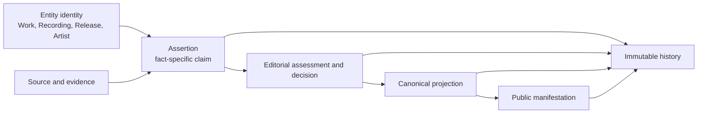
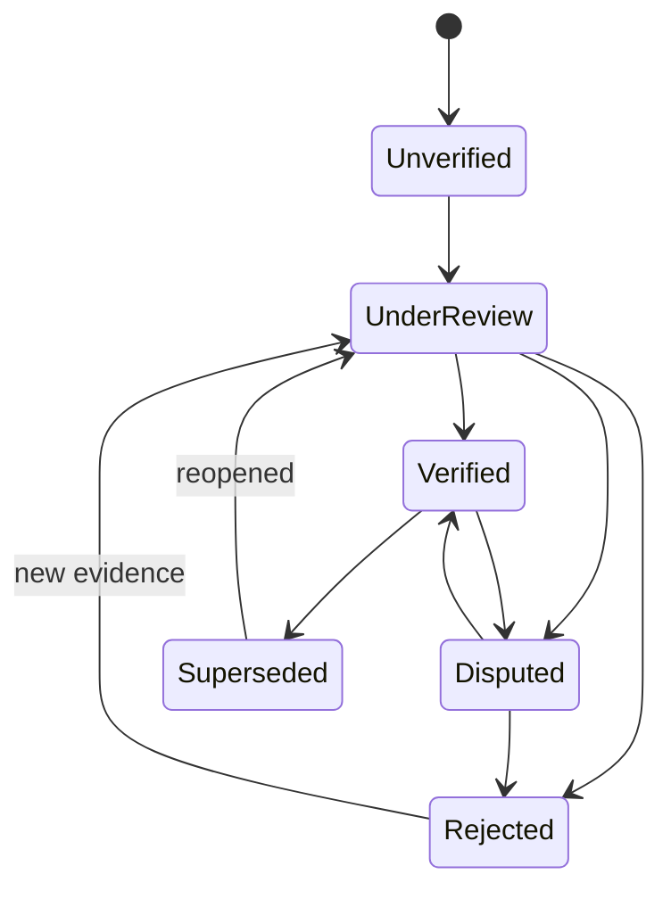

# Mangulina Editorial Governance

Status: Authoritative governance architecture; implementation requires separate approval  
Related: [Music Ontology](MUSIC_ONTOLOGY.md), [Editorial Engine](EDITORIAL_ENGINE.md)

## Purpose and authority

This document governs how Mangulina turns sourced claims into accountable, correctable music knowledge. `MUSIC_ONTOLOGY.md` defines the musical entities; this document defines how Mangulina knows, evaluates, changes, and publishes facts about them; `EDITORIAL_ENGINE.md` governs generated prose. Together they form the Mangulina Music Knowledge Model.

> Mangulina stores editorial assertions supported by evidence, not merely imported metadata.

> Mangulina's authority comes from transparent evidence, careful editorial review, and accountable correction—not from pretending uncertainty does not exist.

A value in a canonical entity column is a current projection, not proof and not the complete history of how it became canonical.

## Knowledge architecture

These seven layers must remain distinguishable:

1. **Entity identity** identifies the persistent thing.
2. **Source/evidence** records who said what, where, and when.
3. **Assertion** records a claim about a subject and property or relationship.
4. **Assessment/decision** records comparison, outcome, authority, and rationale.
5. **Canonical projection** is the currently accepted operational value.
6. **Public manifestation** applies publication, rights, and sensitivity policy.
7. **History** preserves assertions, decisions, and changes.

A canonical fact is a selected assertion. Competing assertions may coexist; acceptance does not erase disagreement, and rejection does not delete a source claim. Canonical columns remain useful for integrity and performance, but must eventually be traceable to an accepted assertion and decision.

An assertion needs a subject, predicate, claimed value, source, evidence links, capture method/time, and status. A decision needs assertions considered, result, rationale, actor, authority, time, policy version, approvals, and any superseded/reversed decision.

## Sources and evidence

Authority is fact-specific; Mangulina must not assign one universal trust score to a source.

| Source class | Often strong for | Cautions |
|---|---|---|
| Label metadata/release assets | Release identity, sequence, supplied IDs | Feed errors, recycled IDs, incomplete credits |
| Liner notes/booklets | Displayed performers, producers, studios | Omissions, reissue differences, transcription |
| Rights societies/publishers | Works, writers, rights claims | Territorial variation, duplicate registrations |
| Artist/estate/producer/label statements | First-party history and corrections | Memory, promotion, conflicts of interest |
| MusicBrainz/Discogs/Wikidata | Discovery and cross-reference | Derived/community claims require their evidence |
| DSP feeds | Commercial manifestations and supplied IDs | Aggregator propagation and duplication |
| Journalism/scholarship | Attributed history and context | Secondary interpretation and edition matter |
| Audio/technical analysis | Duration, audible differences, fingerprints | Record files, method, and tolerances |
| Automation/internal inference | Candidate generation and triage | Never self-authenticating; version and review it |

Evidence can be online or offline. A durable citation may identify a physical release, catalog number, booklet page, archive, interview timestamp, or restricted document; a public URL is not required.

### Recommended evidence model

- Per-domain source tables preserve typing but fragment provenance.
- One generic evidence table is flexible but risks weak referential integrity.
- A **hybrid** shared `sources` identity, assertion-source links, and typed adjuncts combines reusable citation metadata with structured domain evidence.

The hybrid is recommended. A source should support stable ID, class, title, creator/publisher, edition, locator, URL if applicable, publication/retrieval dates, rights/access metadata, preservation status, and a lawful content hash where useful. An evidence link states whether a source supports, contradicts, or merely mentions an assertion.

Citation is not permission to reproduce. Store access and reuse/licensing status separately. Excerpts/assets need their own rights basis. Public pages should normally paraphrase and cite, not republish protected content. URL-only citations are insufficient; retain retrieval date and archive/revision identity where permitted.

## Assertion, decision, and publication lifecycle

Assertion state and canonical resolution are separate dimensions.

- **Unverified:** captured/imported, not editorially established.
- **Under review:** assigned or actively assessed.
- **Verified:** accepted within a defined policy and scope.
- **Disputed:** credible incompatible claims remain.
- **Rejected:** reviewed and not accepted, but preserved.
- **Superseded:** replaced by a later claim or better formulation.

Canonical resolution separately records `unresolved`, `accepted`, `disputed`, `withheld`, or `superseded`. A verified source statement therefore does not automatically become the public canonical value.

**Unknown** means no sufficiently supported value; absence is not a negative claim. **Uncertain** means evidence only supports a qualified value or range. **Disputed** means credible incompatible claims, or a credible challenge to the canonical claim, remain unresolved. These must not collapse into null, false, or an arbitrary winner.

Confidence should be qualitative and policy-linked. Numeric confidence may support calibrated automated triage, but never an unexplained canonical truth score; record model/ruleset version, inputs, calibration, and review thresholds.

### Public manifestation

- Verified, accepted facts may publish subject to rights/sensitivity policy.
- Unverified assertions remain internal by default.
- Disputed material facts are never silently flattened: show a cited dispute treatment when appropriate, or withhold when publication would mislead or cause disproportionate harm.
- Unknown must not imply “none.”
- Rejected/superseded claims remain history unless needed to explain a correction.

Rules are fact-specific. Identifier conflicts can often be labeled; sensitive biographical claims require stricter withholding and escalation.

Internal editorial notes and approved public notes must be separate records or separately access-controlled fields. Internal content must not leak through APIs, exports, search, or logs. Public notes require neutral wording, citations, and approval.

## Decisions and audit history

An editorial decision is first-class, not merely the latest row update. Corrections append a new decision and canonical change; they do not edit old decisions. Reversals point to the reversed decision and state why.

No single audit method is sufficient:

- database triggers capture before/after mutations, including bypass paths;
- application events capture semantic intent, rationale, case, and policy;
- temporal tables reconstruct state but do not explain decisions;
- pure event sourcing would impose a disproportionate rewrite.

Use a **hybrid**: append-only semantic editorial events plus database-enforced mutation history, joined by transaction/correlation ID. Retain human/service/import actor identity, restrict audit writes, and monitor gaps. Hash chaining may strengthen tamper evidence later, but is not “immutability” without operational controls.

## Roles, capabilities, and approvals

Authorization should be capability-based even if current roles remain `owner`, `admin`, and `editor`. Target roles are conceptual bundles, not an instruction to rename roles now.

| Role | Capabilities |
|---|---|
| Contributor | Submit assertions, sources, and draft corrections; cannot establish canon |
| Editor | Verify routine facts, create supported Works, make ordinary Work links, enter sourced credits |
| Senior Editor | Resolve conflicts, approve identity changes, merge/split, reverse consequential decisions |
| Administrator | Manage access, policies, emergency controls, and integrity; technical power is not evidentiary authority |

Permissions attach to actions and fact types, not pages. Service/import accounts have narrow capabilities. Self-approval is prohibited when two-person review is required.

| Action | Minimum review |
|---|---|
| Identity-preserving spelling/format correction | Editor; reason recorded |
| Create a supported Work | Editor; evidence required |
| Initial low-risk Recording-to-Work link | Editor; assertion/evidence required |
| Change a published or multiply-used Work link | Senior Editor or independent second approval |
| Verify/materially alter a public credit | Editor; second approval if contested or broad-impact |
| Resolve identity-bearing identifier conflict | Senior Editor |
| Merge/split Artist, Work, Recording, or Release | Proposer plus independent Senior Editor |
| Delete evidence/assertions/decisions/entities | Normally prohibited; exceptional approved policy only |
| Reverse a consequential decision | Independent Senior Editor; original retained |

Emergency containment may temporarily withhold harmful/legal-sensitive content, but creates an event, expires or receives prompt review, and never silently rewrites history.

## Identity changes, redirects, and corrections

- **Withdraw:** stop treating an assertion as active.
- **Unpublish:** remove a public manifestation while retaining internal records.
- **Deprecate:** mark an ID/entity as no longer preferred.
- **Merge:** redirect one identity after adjudicating equivalence.
- **Split:** create distinct identities and reassign justified relationships.
- **Purge:** irreversible removal, reserved for narrow legal/security requirements with dual authorization and a tombstone where lawful.

Hard deletion is not correction.

Prefer entity-specific redirect/alias tables for Artist, Work, Recording, and Release under a shared routing contract: real foreign keys prevent cross-type corruption. A union view/service can resolve generically. URL/slug redirects are separate and may be generic, but resolve to stable entity IDs. A bare `entity_type + entity_id` registry should not be the identity authority.

### Merge

1. Open a case; freeze conflicting identity edits if needed.
2. Record candidates, equivalence evidence, differences, and impact.
3. Select the survivor by policy, not accidental age/richness.
4. Require independent approval.
5. Repoint relationships transactionally while preserving provenance.
6. Create permanent aliases/redirects and retain the tombstone.
7. Re-evaluate IDs, credits, text, and publication; never blindly union canon.
8. Emit semantic/low-level audit and verify referential counts.

A split creates/identifies resulting entities, records distinguishing evidence, assigns relationships through reviewed assertions, preserves the predecessor/history, redirects only unambiguous routes, and leaves unresolved relationships unresolved. Approval equals merge approval.

| Correction tier | Examples | Governance |
|---|---|---|
| Presentation | Casing/punctuation, no identity effect | Reason and mutation history |
| Factual | Date, duration, ordinary credit text | Evidence and Editor decision |
| Relationship/identity | Work link, attribution, external ID | Impact review; Senior approval if published/contested |
| Structural | Merge, split, mass reassignment | Proposal, impact report, independent approval, verification/recovery plan |

## Conflict review

ISRC is one detector of a general problem spanning Work attribution, duplicate identity, dates, external IDs, and credits. Use a hybrid case model:

- a generic editorial issue/case manages status, subjects, assignment, discussion, decisions, and approvals;
- typed findings preserve detector-specific facts such as ISRC, candidate Recordings, fingerprints, durations, release context, and MusicBrainz IDs;
- typed subject links with real foreign keys are preferred where integrity matters.

Phase 1.5 classifications are evidence inputs, not merge commands. “Probable duplicate” remains review-only until identity evidence meets merge policy. “Different recordings sharing an ISRC” preserves both Recording identities and marks an identifier conflict.

## Work, Recording, ISRC, and credit governance

### Work creation

A Work is a composition, not a Recording cluster. Creation needs evidence distinguishing composition from Recording: e.g. rights registrations, publisher catalogs, credited writers, authoritative catalogs, or convergent sources. Title, artist, duration, or ISRC alone is inadequate.

Valid review outcomes are: create a supported Work; link to an existing Work; or defer because evidence is insufficient/conflicting.

### `recordings.work_id`

The foreign key is the canonical projection of a researched composition relationship, never Recording identity or a deduplication key. Long term each link/change needs a relationship assertion, evidence, and decision while the FK remains an efficient projection. Initial low-risk links may be Editor-approved. Changing a published, downstream-credit-bearing, or widely used link requires impact analysis and Senior/independent approval. Null means unknown/unresolved, not “no Work.”

### Credits

Credits are sourced contribution claims at the correct Work or Recording scope. Draft/unverified credits may exist internally; public credits require verified acceptance or an explicitly approved, visibly qualified provisional policy. Offline citations are valid.

Preserve exact source wording (`credited_as`), role, scope, locator, and mappings to canonical contributor/role identities. Never overwrite source text to match display text. Composition and recording-performance/production credits remain distinct. Contested identity/role changes require downstream profile and Works & Credits impact review. Display deduplication is not a substitute for correct identity.

Imported titles, names, and credit strings remain recoverable evidence. Canonical text is a display/identity projection; normalization, transliteration, and language preference must not destroy source spelling, casing, script, or attribution.

External IDs carry source/time and a state such as `asserted`, `verified`, `conflicting`, `deprecated`, or `replaced`. They inform identity but never determine it alone. No ISRC, MusicBrainz, or provider ID may automatically merge entities.

## Imports and automation

Imports create assertions under a named provider, feed version, job, timestamp, and transformation version; scale grants no authority. Re-imports add/supersede observations without erasing history.

Auto-publication is allowed only for fact types with an approved compatibility contract, provider history, validation, monitoring, and recovery path. Identity merges, similarity-inferred Work links, credits, conflict resolution, and destructive replacement never auto-publish. Automation may create candidates/evidence, not silently establish identity.

## Phase 2 readiness

Production population of Works, Recording-to-Work links, and credits is **blocked pending governance approval and supporting implementation**. Before Phase 2, approve and implement:

1. shared source/evidence identity and citation requirements;
2. assertion and canonical-resolution semantics;
3. semantic decisions and append-only audit controls;
4. capability review and independent high-impact approval;
5. generic cases with typed ISRC findings;
6. merge/split/redirect/withdrawal/exceptional-purge policies;
7. Work creation and `recordings.work_id` evidence thresholds;
8. credit verification, `credited_as`, and visibility rules;
9. import provenance, automation limits, and dispute display;
10. monitoring, recovery tests, and referential/count verification.

Phase 1.5 findings can design queues; they do not authorize Works, links, credits, conflict resolution, or merges.

## Recommended future structures (not implemented)

- shared `sources` with typed adjuncts and assertion-evidence links;
- fact/relationship assertions and immutable editorial decisions;
- semantic events correlated to mutation history;
- editorial cases, typed findings, assignments, and approvals;
- entity-specific aliases plus generic route redirects;
- separate internal and approved-public notes;
- fact-level publication projections where withholding is required.

Names, cardinalities, retention, RLS, and transaction boundaries need separate design approval.

## Invariants

1. An import or scalar column is not self-authorizing.
2. Assertion, evidence, decision, canonical projection, and publication stay distinct.
3. Credible conflicts may coexist without forced resolution.
4. Unknown, uncertain, disputed, rejected, and superseded differ.
5. Corrections append history.
6. Merge/split requires evidence, impact analysis, independent approval, and redirects.
7. External IDs inform identity but never independently determine it.
8. Work, Recording, release appearance, and ISRC assignment remain distinct.
9. Internal notes never publish by default.
10. Authority is constrained by capability, policy, evidence, and accountability.

## Phase 1.75 operational foundation

Migration `20260809000000_editorial_governance_foundation.sql` makes the minimum governance foundation operational without populating Works, links, credits, cases, findings, or redirects.

- `editorial_sources` is the reusable citation identity. URL is optional; visibility is `public`, `internal`, or `restricted`; internal/public notes and rights notes are distinct.
- `editorial_assertions` is a common lifecycle envelope. Entity integrity is supplied by typed Work, Recording, Work-credit, Recording-credit, ISRC, and Recording-to-Work relations. A deferred constraint requires exactly one typed subject/target.
- `editorial_assertion_evidence` implements many-to-many `supports`, `disputes`, and `contextualizes` links.
- `editorial_decisions` and `editorial_decision_assertions` preserve semantic decisions. Independent approval is database-constrained and the idempotent approval RPC rejects self-approval.
- `editorial_audit_events` is append-only. Canonical mutations to `recordings.work_id`, Work credits, and ISRC assignments generate protected low-level events; semantic decisions remain separate.
- Existing `owner`, `admin`, and `editor` roles map additively to named capabilities. High-impact capabilities are withheld from Editor.
- Generic `editorial_cases` use typed entity links and typed ISRC findings. The 220 existing conflicts were not converted into cases.
- Artist, Work, and Recording redirects are entity-specific and require decisions. A recursive database trigger prevents two-node and longer cycles. URL redirects remain separate.
- Every new governance relation has RLS enabled, no anonymous/authenticated table grants, and service-role-only table access. No new public query uses these tables.

The audit event table has indefinite retention until an archival policy is approved. Decisions cannot be deleted; audit events cannot be updated or deleted. Assertions and sources remain correctable through governed status/supersession rather than blanket append-only enforcement.

Phase 1 provenance tables retain their fields and rows and now have optional `source_id` links. They are not destructively normalized. Their historical public-read policy, including ambiguous legacy notes, remains a documented compatibility/security transition requiring usage analysis before restriction.

Consequential state transitions should use transactional RPCs rather than direct table mutation. Phase 1.75 implements decision approval as the first pattern; Work linking, canonical assertion selection, and merge/split RPCs remain gated. At million-row scale, audit events and assertions are likely partition candidates by time after measured growth; current indexes cover status, queues, typed subjects, source links, correlation IDs, and timestamps.

## Phase 1.8 approval and workflow matrix

| Operation | Capability | Approval |
|---|---|---|
| Create internal/restricted source | `source.create` | Editor; no second approval |
| Create draft authoritative Work | `work.create` | Editor; no title-based identity inference |
| Create Recording-to-Work assertion | `assertion.create` | Editor |
| Select initial Work when unresolved | `work.link_recording` | Editor |
| Replace an existing different Work | `work.link_recording` then `decision.approve` | Independent approver required; projection remains unchanged until approval workflow executes |
| Create unverified Work credit | `credit.create` | Editor |
| Verify Work credit | `credit.verify` and `assertion.verify` | Editor; contested changes escalate under existing governance |

All implemented writes are service-role-only RPCs called behind authenticated admin APIs. The database independently verifies that the supplied human actor is an active `admin_members` user with the required capability. Each operation is atomic and idempotent. Direct public/authenticated mutations remain unavailable.

Legacy provenance direct SELECT was removed from anonymous/authenticated roles after a code-consumer audit found no public application dependency. Rows, notes, and service-side access remain intact. New evidence uses `editorial_sources` and assertion-evidence links.

The future public contract has two non-overlapping channels: canonical Work credits keyed by Work/Artist/role IDs, and canonical Recording credits keyed by Recording/Artist/role IDs. `credited_works` remains explicitly archival/editorial portfolio material and is never UNIONed into canonical results or deduplicated by title. Artist profiles will eventually show composition contributions once per Work identity and recording contributions once per Recording identity.

## Phase 2A external contributor governance

`external_contributors` is private by default and has no anonymous or ordinary authenticated table access. Creation is available only through the idempotent `create_external_contributor` workflow, which verifies an active staff actor and `external_contributor.create` capability, reports normalized-name candidates without auto-merging or prohibiting legitimate namesakes, creates a typed identity assertion, attaches supplied evidence, and records a decision and audit event. Owner, Admin, and Editor receive the narrowly scoped create/edit capabilities under the existing role model.

The public boundary is implemented with security-definer projections that return only approved presentation fields. Internal notes, metadata, restricted sources, identifiers, and history are never returned. Images use the existing authorized server upload, safe decode, square WebP processing, and non-listable `contributors-images` storage architecture; no client Storage mutation or new public listing policy is introduced.

## Governed Recording Credits

`save_editorial_recording_credit` is the authorized semantic save path for new and edited Recording Credits. It verifies the active staff actor and `credit.create` capability, exclusive Artist-or-External identity, controlled Recording role scope, contributor availability, semantic uniqueness, instrument compatibility, and idempotency. It writes the canonical credit, typed Recording Credit assertion, evidence relationships, decision, and semantic audit event transactionally.

The instrument tables are private, service-managed relations with RLS enabled and no anonymous/authenticated direct grants. Existing legacy Recording Credit maintenance paths remain server-authorized for compatibility, but new semantic entry uses the governed RPC. Release appearance and ISRC displays are read projections and do not collapse their distinct mutation/governance boundaries into Recording identity updates.

## Phase 1.9 pilot readiness

The admin workflow now exposes searchable Work selection, in-context draft creation, and **Leave unresolved** as an explicit outcome. Search results include lifecycle, year, and Recording-count context and never auto-select or infer identity. The shared combobox supports keyboard arrows, Enter, Escape, mouse selection, empty state, and responsive layout.

Evidence attachments explicitly select `supports`, `disputes`, or `contextualizes`; multiple sources with different relationships attach to one assertion. Replacement and unlink requests preserve the current projection pending independent approval. Approval atomically supersedes the prior accepted assertion, accepts the proposal, changes or nulls `recordings.work_id`, finalizes the decision, and appends audit history. Rejection preserves the canonical link and evidence while marking the proposal rejected.

The editorial timeline is a read projection of semantic audit events, assertions, decisions, and evidence. Its “Why?” affordance is admin-only and is not a new source of truth. UUIDs remain canonical internal identifiers; stable public citation identifiers should be evaluated before research/citation APIs are finalized.
