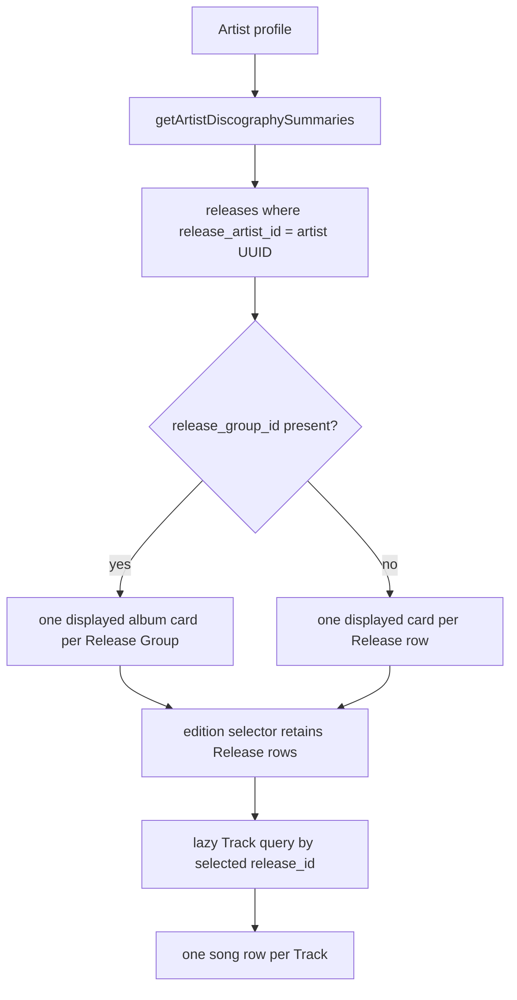

# Alex Bueno Full Discography Integrity Audit

**Audit date:** 2026-08-08  
**Mode:** read-only production snapshot plus repository query inspection  
**Canonical artist UUID:** `6c3e0d74-23b7-4d80-969f-9d5319ee5127`

## Executive summary

Alex Bueno's catalog is structurally consistent at the Track relationship layer but highly fragmented at the Recording identity layer. The canonical artist owns **638 Recording rows**, represented by **839 distinct Track rows** across **84 distinct Release rows** and **61 populated Release Groups**. There are **no exact duplicate Track signatures** under `(recording_id, release_id, disc, track_number, position)`.

The repeated Release Appearances observed for `Colegiala` are edition-level rows, not query multiplication or duplicate Track relationships. Both `Alex & Orquesta Liberación` (1985) rows belong to one Release Group but have distinct Release UUIDs and MusicBrainz release MBIDs; their country/packaging metadata differs (`DO`/unknown versus `XW`/`None`). The two `Grandes éxitos de Alex Bueno en bachata` (2001) rows likewise share one Release Group but differ as `ES`/`Jewel Case` and `XW`/`None`. On present evidence these are **legitimate separate editions**.

The material integrity risk is Recording fragmentation: **137 normalized-title groups** contain more than one canonical-Alex Recording. Alex participates in **69 of the global 220 ISRC conflict groups**. A conservative evidence rule classifies 40 as `probable_duplicate_recording`, 17 as `different_recordings_shared_isrc`, and 12 as `insufficient_evidence`. These are review classifications, not merge instructions.

All **638** canonical-Alex Recordings have `recording_year = NULL`; **0** have a Work link. Work population should therefore follow identity review, especially for the 40 strong ISRC/duration duplicate groups.

## Scope and method

The canonical scope is `recordings.artist_id = 6c3e0d74-23b7-4d80-969f-9d5319ee5127`. The Gabriel Pagán collaboration is separately included in the Colegiala deep dive because Alex appears in its imported artist-credit metadata while Gabriel is the headline Mangulina artist.

All database operations were `SELECT`. Candidate signatures were used only as review signals:

- Recording: accent-insensitive normalized title, performer ownership, duration, MBID, ISRC overlap, disambiguation, imported artist credit, and appearances.
- Track: Recording + Release + disc + track number + position.
- Release: normalized title + year, refined by Release Group, MBID, country, packaging, date, barcode, and catalog number.

The ISRC classes use this conservative rule: same normalized title, same canonical artist, and duration spread at most 1,000 ms is `probable_duplicate_recording`; different normalized titles is `different_recordings_shared_isrc`; the remainder is `insufficient_evidence`.


## 1. Canonical artist identity

| Field | Value |
|---|---|
| Artist UUID | `6c3e0d74-23b7-4d80-969f-9d5319ee5127` |
| Preferred name | Alex Bueno |
| Sort name | Bueno, Alex |
| Slug | `alex-bueno` |
| MusicBrainz artist MBID | `e7f63397-83ae-4506-b015-4b604ac38b01` |
| Type | `solo_artist` |
| Status | `published` |
| Primary role | `singer` |
| Primary genre | `merengue` |
| Ended | `true` |

Only one Mangulina Artist row matched Alex Bueno by name.

## 2. Full inventory

| Measure | Count |
|---|---:|
| Recording rows owned by canonical Alex | 638 |
| Distinct Track appearances | 839 |
| Distinct Releases reached through those Tracks | 84 |
| Distinct non-null Release Groups | 61 |
| Normalized ISRC assignments | 493 |
| Recordings with zero normalized ISRCs | 179 |
| Recordings with exactly one normalized ISRC | 437 |
| Recordings with multiple normalized ISRCs | 22 |
| Recordings with zero Track appearances | 0 |
| Recordings appearing on multiple Releases | 88 |
| Recordings with non-null `work_id` | 0 |
| Recordings with null `recording_year` | 638 |

These counts are separate entity levels. In particular, 839 Track rows do not mean 839 Recordings, and 84 Release editions do not mean 84 albums.

## 3. Recording identity findings

The scan found **137 same-normalized-title groups**. The largest queues demonstrate why title equality cannot determine identity:

| Normalized title | Recording rows | Distinct known durations | Null durations |
|---|---:|---:|---:|
| quien te riza el pelo | 14 | 10 | 1 |
| querida | 13 | 10 | 0 |
| quiéreme | 11 | 8 | 0 |
| qué cara más bonita | 10 | 6 | 0 |
| que vuelva | 10 | 7 | 0 |
| ese hombre soy yo | 9 | 6 | 0 |
| gotas de pena | 9 | 6 | 0 |
| me muero por ella | 9 | 6 | 1 |
| me va, me va | 9 | 7 | 0 |
| mi pobre corazón | 9 | 6 | 2 |

Different durations, explicit `version bachata`/`version merengue` disambiguations, different collaborator credits, and different MBIDs establish that many rows are clearly distinct versions or rerecordings. Conversely, identical normalized title + identical duration + shared ISRC is strong evidence of ingestion/MusicBrainz fragmentation.

Catalog-wide adjudication cannot be truthfully completed from these imported fields alone. The defensible quantified queues are:

- **40 probable duplicate Recording conflict groups**: same artist/title and duration within 1 second while sharing an ISRC.
- **17 different-recordings-shared-ISRC groups**: the same ISRC spans different normalized titles; these require source-level review and must not be merged automatically.
- **12 insufficient-evidence ISRC groups**.
- **137 normalized-title review groups**, overlapping the three ISRC queues above; these counts are deliberately not additive.

Every candidate retains a distinct Mangulina UUID and MBID. No row was merged or reclassified in data.

## 4. Track Appearance audit

The exact duplicate signature scan returned **zero groups** for:

```text
recording_id + release_id + coalesced disc + track_number + position
```

Therefore the repeated-looking appearances are not duplicate relationships under the requested signature. Track MBIDs and lengths may differ between editions, which is normal edition-level data. No evidence supports deleting any Track.

## 5. Release and Release Group audit

The scan found **19** same-normalized-title/year candidate pairs. All 19 pairs:

- contain exactly two Release rows;
- have two distinct MusicBrainz release MBIDs;
- belong to the same populated Release Group within each pair;
- have edition differentiators such as country, packaging, or release date.

| Release title | Year | Release Group conclusion |
|---|---:|---|
| 1 | 2015 | one group, two editions |
| 20 años después | 2004 | one group, two editions |
| 20 años después, vol. 2 | 2004 | one group, two editions |
| Alex Bueno | 1990 | one group, DO and XW editions |
| Alex & Orquesta Liberación | 1985 | one group, DO and XW editions |
| Amores que matan | 1994 | one group, DO and XW editions |
| Bachata a su tiempo | 1998 | one group, US Jewel Case and XW editions |
| Bachatas en ternuras | 2009 | one group, US Jewel Case and XW editions; dates differ |
| Como quisiera | 1983 | one group, DO and XW editions |
| Corazón duro | 2000 | one group, Jewel Case and `None` packaging |
| Grandes éxitos de Alex Bueno en bachata | 2001 | one group, ES Jewel Case and XW editions |
| Más ternura | 1997 | one group, DO and XW editions; dates differ |
| Me equivoqué | 1996 | one group, packaging differs |
| Mensajes | 2008 | one group, US and XW editions; dates differ |
| Pídeme | 2002 | one group, US and XW editions; dates differ |
| Queda algo | 2007 | one group, US and XW editions; dates differ |
| Solo merengue | 2002 | one group, US and XW editions; dates differ |
| Ternuras | 1992 | one group, US and XW editions; dates differ |
| Únicamente tú | 2001 | one group, CO Digipak and XW editions |

**Classification:** 19 legitimate same-album/different-edition groups; 0 probable duplicate Releases on current evidence; 0 same-Release-imported-twice findings. Missing barcode/catalog/label data limits certainty, but distinct MB release identity plus edition metadata is affirmative evidence, not merely absence of proof.

## 6. Colegiala deep dive

There are **six Recording identities** in the global title scan: five owned by Alex and one Gabriel Pagán headline collaboration. The five Alex-owned rows account for 18 Track appearances; the collaboration adds two.

| Recording UUID | Identity evidence | Duration | ISRCs | MBID | Appearances | Classification |
|---|---|---:|---|---|---:|---|
| `0fea06fb-180e-404b-a6cd-aa8351ae188d` | explicit `version bachata` | 260,360 ms | `USJ3V1498092` | `20588205-9470-45f4-9a25-afa9d418e7db` | 3 | alternate version, clearly distinct |
| `6531cb3f-74da-42a6-a2e5-3eda3682deef` | Gabriel Pagán feat. Alex Bueno | 212,000 ms | `DOA571800001` | `919453d3-e082-42dd-b958-0c51e98c5c42` | 2 | collaboration, clearly distinct |
| `698e33d6-115d-4801-8acf-73376269492f` | Alex solo credit | 291,640 ms | `USJ3V1497149` | `ed11b408-550d-415d-a157-f55d4fe2717a` | 4 | possible duplicate/rerecording; insufficient evidence versus `a313…` |
| `a313df5d-479b-4f7e-b980-87d5d6abfedd` | Alex & Orquesta Liberación | 288,000 ms | `USJ3V1498118`, `USJ3V1841803` | `5d11aeaf-568b-49a1-b98f-ab8391eba91b` | 5 | possible original/rerecording; insufficient evidence versus `698e…` |
| `ed8a0861-8328-488f-bfd5-652a69f148d9` | explicit `version merengue`, later source context | 298,360 ms | `US3Z40407609`, `US3Z41500153` | `d3c22f2c-5967-49b2-9250-abb42dfc9866` | 5 | alternate version, clearly distinct |
| `220cbbd4-f2c3-480e-8161-df3a9b69ae50` | title explicitly `Colegiala (sinfónico)` | 305,847 ms | `US3Z42400262` | `ed8d1684-4d73-49ee-916c-a7b37943f37a` | 1 | orchestral alternate version, clearly distinct |

### All Colegiala appearances

| Recording | Track UUID | Release UUID | Release / year | Release MBID / group | Edition | Disc-track-position |
|---|---|---|---|---|---|---|
| `0fea…` | `6c0053b0…` | `f3917b09…` | Grandes éxitos… / 2001 | `0f466fbe…` / `7416fbe6…` | XW, None | 1-2-2 |
| `0fea…` | `99d84904…` | `a4ac23d7…` | Grandes éxitos… / 2001 | `9c00b169…` / `7416fbe6…` | ES, Jewel Case | 1-2-2 |
| `0fea…` | `16370ae6…` | `992c2454…` | Entre bachata y merengue / 2005 | `61576468…` / `67c22dd4…` | US, Jewel Case | 1-2-2 |
| `6531…` | `20bf2c2b…` | `98ea8822…` | Colegiala / 2018 | `243d0177…` / `02a6e77e…` | US, None | 1-1-1 |
| `6531…` | `be15b76b…` | `5705c127…` | Mori'soñando, vol. 1 / 2019 | `9044ef46…` / `b2ff4f30…` | XW, None | 1-12-12 |
| `698e…` | `ac1a2872…` | `9e517a94…` | Los grandes de Alex Bueno / 1985 | `1cf452eb…` / `de9c3891…` | unknown | 1-6-6 |
| `698e…` | `a5b3a14c…` | `55d2f4ff…` | Los años dorados / 1993 | `f9f42440…` / `34d6c8eb…` | XW, None | 1-2-2 |
| `698e…` | `77f18b68…` | `992c2454…` | Entre bachata y merengue / 2005 | `61576468…` / `67c22dd4…` | US, Jewel Case | 1-8-8 |
| `698e…` | `36c2dd8a…` | `4459a086…` | Grandes éxitos / 2022 | `e38996c4…` / `af01603b…` | XW, None | 1-7-7 |
| `a313…` | `7045ee22…` | `e78f16ed…` | Alex & Orquesta Liberación / 1984 | `fb21d9ef…` / `4dc82373…` | DO | 1-8-8 |
| `a313…` | `82c84080…` | `b8d7126a…` | Alex & Orquesta Liberación / 1985 | `0e9281c7…` / `4dc82373…` | DO | 1-8-8 |
| `a313…` | `ed459cdb…` | `43e55067…` | Alex & Orquesta Liberación / 1985 | `e97c195d…` / `4dc82373…` | XW, None | 1-8-8 |
| `a313…` | `5327d146…` | `2d04d4df…` | Los grandes de Alex Bueno / 1992 | `61473656…` / `de9c3891…` | XW, None | 1-6-6 |
| `a313…` | `7df13761…` | `cf626bd2…` | Los años dorados / 1999 | `be870980…` / `34d6c8eb…` | DO | 1-2-2 |
| `ed8a…` | `0f24e416…` | `6837ea25…` | 20 años después, vol. 2 / 2004 | `d1674566…` / `dc99b5bb…` | XW, None | 1-1-1 |
| `ed8a…` | `cdeee03f…` | `a7ec8abf…` | 20 años después, vol. 2 / 2004 | `0739ea66…` / `dc99b5bb…` | US | 1-1-1 |
| `ed8a…` | `82bee7a3…` | `ea5d3f79…` | 1 / 2015 | `4da0096c…` / `d9814db7…` | XW, None | 1-19-19 |
| `ed8a…` | `859bac37…` | `8b1a5769…` | 1 / 2015 | `195c65b2…` / `d9814db7…` | unknown | 1-19-19 |
| `ed8a…` | `b544e4c6…` | `4f9b3680…` | Los rostros del merengue / 2019 | `1395d53e…` / `f373d106…` | XW, None | 1-5-5 |
| `220c…` | `26d86187…` | `9357f764…` | Colegiala (sinfónico) / 2024 | `5a02e4d6…` / `817746ff…` | XW, None | 1-1-1 |

No listed edition has a barcode or catalog number in Mangulina.

### Exact explanation of the repeated pairs

`Alex & Orquesta Liberación` (1985): two Release rows, one shared Release Group, distinct release MBIDs, and DO versus XW/None edition metadata. Each has one distinct Track row at 1-8-8 pointing to the same `a313…` Recording. **Legitimate editions; not duplicate Tracks; not query duplication.**

`Grandes éxitos de Alex Bueno en bachata` (2001): two Release rows, one shared Release Group, distinct release MBIDs, and ES/Jewel Case versus XW/None edition metadata. Each has one distinct Track row at 1-2-2 pointing to the bachata `0fea…` Recording. **Legitimate editions; not duplicate Tracks; not query duplication.**

## 7. ISRC audit

| Classification | Conflict groups |
|---|---:|
| `probable_duplicate_recording` | 40 |
| `different_recordings_shared_isrc` | 17 |
| `insufficient_evidence` | 12 |
| **Total Alex-related conflicts** | **69** |

Every one of these 69 appears in the deployed `recording_isrc_conflicts` view and therefore belongs to the stated global set of 220. The normalized table contains 493 assignments across Alex's 638 owned Recordings. Multiple assignments on 22 rows are not themselves conflicts; conflict means one normalized ISRC is assigned to more than one Recording.

## 8. Year consistency

- `recording_year` is null on all 638 canonical-Alex Recordings.
- Imported Recording metadata frequently contains `first-release-date`; that field is evidence about observed release context, not automatically the performance date.
- No deployed Recording year equals a Release year because no Recording year is populated; therefore there is no evidence that Release years were copied into Recording years.
- No connected Release has a conflict among `release_year`, legacy `year`, and the year component of `date` under the audit comparison.
- No Works are linked, so composition/publication years are not present in this Recording scope.

## 9. Discography projection behavior



The public artist profile is Release-driven, not Recording-driven. `getArtistDiscographySummaries` filters `releases.release_artist_id`, groups populated rows by `release_group_id`, chooses a representative edition by country/date/creation rank, and retains all Release rows in an edition list. Therefore the 19 candidate pairs appear as 19 album-level cards with two editions rather than 38 albums. Un-grouped editions would appear separately.

The lazy release-track endpoint returns one response item per Track row and joins Recording metadata by `recording_id`. Since the exact Track duplicate scan is empty, Track appearances are not currently multiplying the same logical slot. Alternate Recordings are not collapsed: whichever Recording UUID a Track references is shown.

The admin discography endpoint differs: it directly filters Releases by `release_artist_id` and returns one item per Release row with a Track count. It does **not** group by Release Group. Thus legitimate editions are shown separately in admin, including both repeated-looking Colegiala pairs. That is current behavior, not evidence of data duplication.

The Recording Workspace is Recording-driven and intentionally lists every Track-derived Release appearance. It therefore exposes edition multiplicity that the public profile groups.

## 10. Quantified integrity state

| Issue class | Count | Interpretation |
|---|---:|---|
| Probable duplicate Recording conflict groups | 40 | strong shared-ISRC/title/duration evidence; review before Work links |
| Possible duplicate / insufficient-evidence ISRC groups | 12 | unresolved |
| Different-recordings-shared-ISRC groups | 17 | do not merge based on ISRC |
| Same-normalized-title Recording groups | 137 | broad, overlapping review queue; not all duplicates |
| Clearly distinct same-title Colegiala identities | 4 of 6 | bachata, merengue, sinfónico, Gabriel collaboration |
| Unresolved Colegiala identity pair | 2 rows | `698e…` versus `a313…`; possible original/rerecording/duplicate |
| Exact duplicate Track candidates | 0 | no Track cleanup supported |
| Same-title/year Release candidate groups | 19 | all supported as separate editions |
| Probable duplicate Releases | 0 | none evidenced |
| Release year/date conflicts | 0 | none detected |
| Alex-related ISRC conflicts | 69 | subset of global 220 |

## 11. Risk assessment

| Area | Risk | Effect |
|---|---|---|
| Recording Workspace | High | Fragmented masters create many similar rows and edition appearances, increasing wrong-link risk. |
| Release Appearances | Low data risk, medium UX risk | Rows are real editions, but admin presentation can look duplicated without edition context. |
| Public discography | Medium | Release Groups correctly collapse populated editions; missing/wrong groups can still split an album. |
| Future Work linking | Critical | Linking all 137 title groups mechanically could conflate alternate performances or attach the same performance repeatedly. |
| Work Credits | Critical downstream | Composition credits can be repeated or attached to the wrong Work if Recording identity is unresolved first. |
| Recording Credits | High | Copying credits across probable duplicate Recording rows can duplicate artist-profile output and misstate alternate versions. |
| Analytics | Medium | Views accrue to separate Recording and Release UUIDs, fragmenting aggregate identity. |
| Search | High | Same-title rows compete without sufficient version labels. |
| Artist profile | Medium | Public albums are group-aware, but song rows remain Track/Recording specific and credits can fragment. |

## 12. Recommended correction order

1. **Preserve current query behavior and document edition semantics.** No query multiplication bug was found in the repeated Colegiala pairs.
2. **Review the 40 probable duplicate Recording conflict groups**, preserving all MBIDs, ISRC observations, Track history, and provenance. Establish redirect/merge audit semantics before any merge.
3. **Review the 17 shared-ISRC/different-title groups and 12 insufficient groups** against primary evidence; do not treat ISRC as master identity.
4. **Resolve explicit version identity and improve disambiguation** across the 137 normalized-title groups, starting with high-frequency groups.
5. **Validate Release Group assignments and edition metadata**, especially null barcode/catalog/label fields. Do not collapse the 19 evidenced edition pairs.
6. **Review year evidence** and populate Recording year only where performance/session evidence exists, never from Release year alone.
7. **Begin Work linking only after Recording review**, starting with clearly distinct, evidenced performances and retaining unresolved status where necessary.
8. **Attach Work and Recording Credits at their correct scopes** after identities are stable; preserve assertions, evidence, approvals, and history.

Any future correction must preserve Mangulina UUIDs where possible, every Track and Release relationship, external identifiers, source evidence, redirects for superseded identities, and an auditable decision trail. Destructive deduplication is not recommended.

## Audit limitations

This report distinguishes database evidence from conclusions. MusicBrainz MBIDs and imported metadata are external identity claims, not proof that audio is identical. No audio fingerprint, label master documentation, session logs, or primary-release scans were available. Accordingly, rows without convergent title, duration, performer, ISRC, and edition evidence remain unresolved. Counts reflect the production snapshot at the audit time and may change with ingestion.
