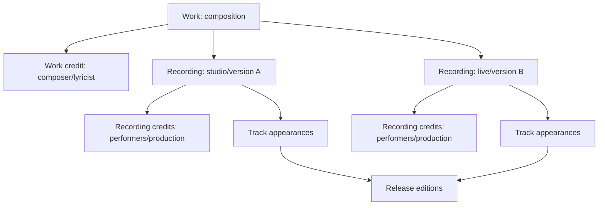
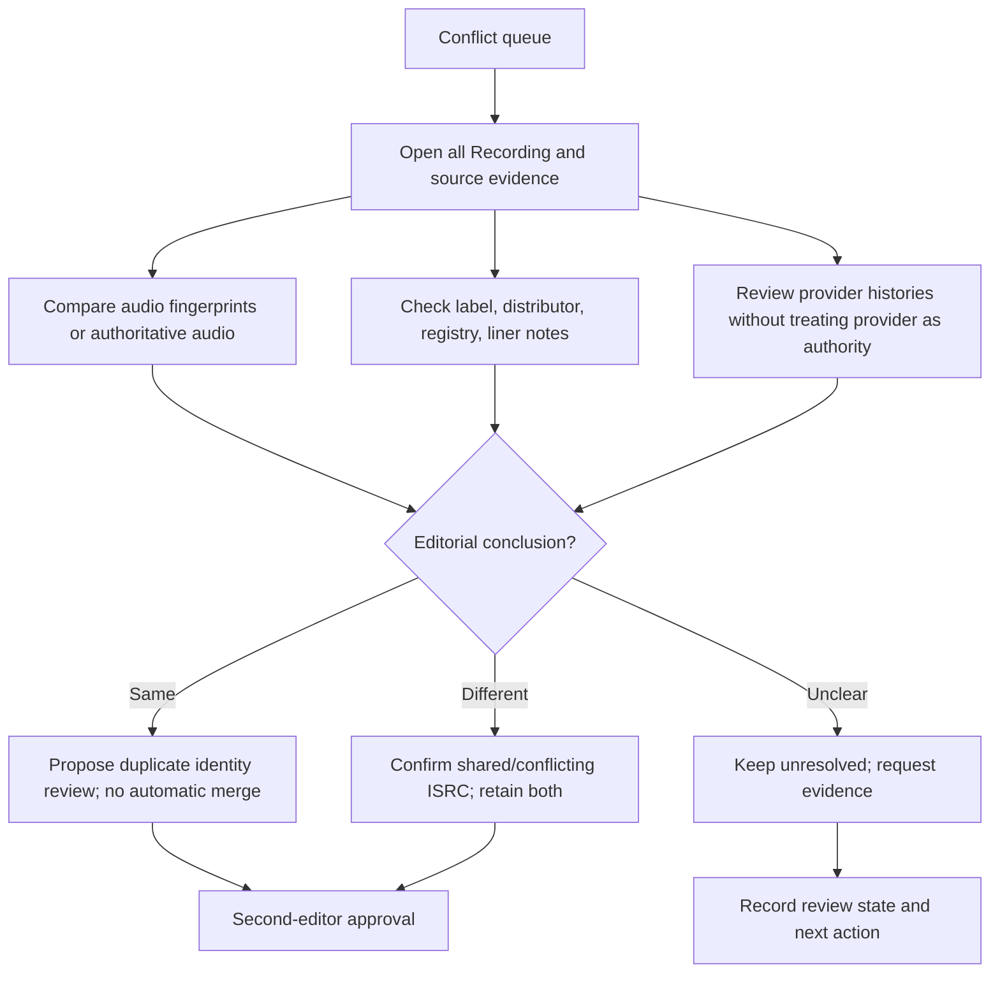
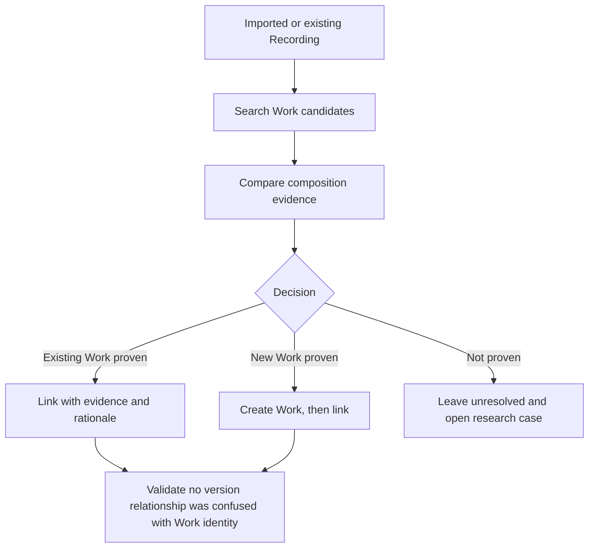
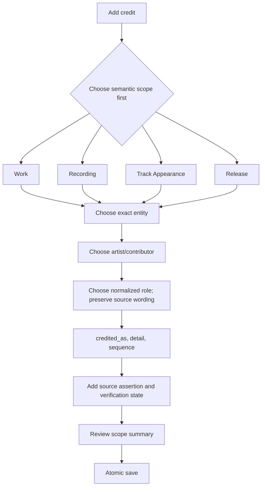
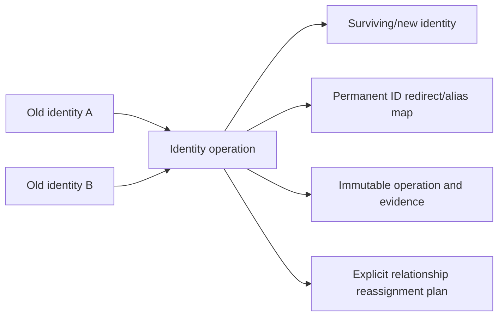

# Mangulina Music Ontology — Phase 1.5 Validation

**Date:** 2026-08-07  
**Scope:** Production-data validation and workflow design only  
**Mutations:** No Work creation, Recording-to-Work linking, credit migration, identity merge, or public UI change

## Executive decision

The Phase 1 ontology is fit to proceed to detailed Phase 2 planning, but Phase 2 must not begin until four workflow foundations are approved:

1. an explicit three-outcome Recording-to-Work decision: link, create, or unresolved;
2. scope-first credit entry with evidence captured in the same transaction;
3. an ISRC conflict review queue whose classifications are editorial assertions, not automated identity decisions;
4. audit and identity-redirection designs for future correction.

The catalog evidence confirms that duplicate credits disappear when authorship belongs to Work, participation belongs to Recording, and release appearances remain Tracks. It also confirms that titles, durations, ISRCs, and provider IDs are useful evidence but unsafe identity keys.



## Production baseline

At validation time:

- Works: 0
- populated `recordings.work_id`: 0
- Recordings: 17,094
- Tracks: 22,756
- Releases: 3,169
- normalized ISRC assignments: 4,918
- Recordings with multiple ISRCs: 170
- conflicting ISRC values: 220, covering 495 assignments
- `recording_credits`: 52
- `credited_works`: 603
- `credited_work_credits`: 379

No identity was inferred during this phase.

## Real catalog validation

### Case 1 — Alex Bueno: Colegiala

**Prospective Work:** `Colegiala`; it does not yet exist and must not be created from title equality alone.

| Recording | Evidence | ISRCs | Appearances | Current credits | Future ownership |
| --- | --- | --- | ---: | ---: | --- |
| `a313df5d…` | Alex & Orquesta Liberación identity; 288,000 ms | `USJ3V1498118`, `USJ3V1841803` | 5 | 0 | performance/production at Recording; composition at Work |
| `698e33d6…` | Alex Bueno identity; 291,640 ms | `USJ3V1497149` | 4 | 0 | same scopes; equivalence to prior row unresolved |
| `0fea06fb…` | explicit bachata version; 260,360 ms | `USJ3V1498092` | 3 | 0 | version personnel at Recording |
| `ed8a0861…` | explicit merengue version; 298,360 ms | `US3Z40407609`, `US3Z41500153` | 5 | 0 | version personnel at Recording |
| `6531cb3f…` | Gabriel Pagán featuring Alex Bueno; 212,000 ms | `DOA571800001` | 2 | 0 | collaboration performers at Recording |
| `220cbbd4…` | 2024 symphonic recording; 305,847 ms | `US3Z42400262` | 1 | 0 | new performance/arrangement at Recording; shared authorship at Work |

The two early rows remain separate because stored evidence does not establish master equivalence. The symphonic row is a defensible rerecorded performance, but no `rerecording_of` relationship is implemented yet.

### Case 2 — one Recording on many Releases: Colegiala `a313df5d…`

The same Recording is reused through five Track Appearances: three editions of *Alex & Orquesta Liberación*, *Los grandes de Alex Bueno*, and *Los años dorados*. This validates the existing Recording → Track → Release model. Credits must not be copied per release appearance unless evidence describes an edition-specific printed credit.

### Case 3 — multiple versions: Don Miguelo, 7 locas

| Recording | Version | Duration | Releases | ISRCs | Credits |
| --- | --- | ---: | ---: | --- | ---: |
| `9ce2cbf7…` | dembow | 196,080 ms | 2 | none | 0 |
| `1221ba15…` | merengue urbano, with Antony Santos in imported artist credit | 319,573 ms | 1 | none | 0 |

The explicit version labels, major duration difference, and different performer billing justify distinct Recordings. A shared Work is plausible but requires editorial evidence rather than title matching.

### Case 4 — collaboration: Gabriel Pagán featuring Alex Bueno, Colegiala

Recording `6531cb3f…` has a distinct MBID, 2018 ISRC, 212-second duration, collaboration billing, and two release appearances. Alex Bueno's participation belongs to this Recording. Composer and lyricist assertions, once established, belong to the Work and should not be copied to this row merely because it is another recording of the composition.

### Case 5 — live and studio: Omega, Chambonea

| Recording | Version | Duration | Releases |
| --- | --- | ---: | ---: |
| `6e825473…` | studio | 260,000 ms | 2 |
| `acb5f653…` | live | 390,000 ms | 3 |

The explicit studio/live evidence and 130-second difference establish separate Recordings. Work authorship is shared only after Work equivalence is researched. Venue, live personnel, producer, and engineer credits are Recording-scoped.

### Case 6 — rerecorded performance: Colegiala (sinfónico)

Recording `220cbbd4…` is a distinct 2024 symphonic performance with a unique MBID, ISRC, duration, and release. It validates the need for a separate Recording under a shared Work and a future typed `rerecording_of` or `alternate_version_of` assertion. Phase 1.5 does not create that relationship.

### Case 7 — multiple ISRCs and many appearances: Amor de conuco

Recording `8b24ab68…`, explicit pop version, contains four ISRC assignments and appears on fourteen Releases from 1998 through 2025. One Track title calls it “nueva versión.” This proves:

- an ISRC is many-valued evidence around a Recording;
- a Release does not define a Recording;
- Track display text may differ without changing Recording identity;
- provider/release wording must not automatically create a new Recording.

Current Recording credits for every selected validation case are zero.

## ISRC conflict audit

### Population

| Recordings per ISRC | ISRC count |
| ---: | ---: |
| 2 | 183 |
| 3 | 22 |
| 4 | 12 |
| 5 | 3 |
| **Total** | **220** |

These represent 495 Recording–ISRC assignments.

### Conservative classification of every conflict

Every conflict was assigned exactly one review classification using stored evidence. These are triage classifications, not identity resolutions.

| Classification | ISRCs | Assignments | Meaning |
| --- | ---: | ---: | --- |
| Probable duplicate Recording | 152 | 315 | Same legacy artist, duration spread ≤2 seconds, and no explicit live/studio/remix/acoustic/symphonic marker |
| Different Recordings sharing one ISRC | 10 | 34 | Distinct artist and title evidence, or explicit performance-type divergence with a duration spread over 10 seconds |
| Insufficient evidence | 58 | 146 | Remaining conflicts; stored catalog evidence cannot support either conclusion |
| Identical Recording | 0 | 0 | Requires audio/source proof; metadata resemblance is insufficient |
| Distributor mistake | 0 | 0 | No distributor-specific provenance is stored |
| MusicBrainz inconsistency | 0 resolved | 495 source-pattern flags | All legacy claims came through `recordings.isrcs`, but source lineage alone does not prove MusicBrainz is wrong |
| Label inconsistency | 0 | 0 | No label assertion evidence is stored |
| Historical reassignment | 0 | 0 | No dated registry/label evidence is stored |
| Unknown | 0 | 0 | “Insufficient evidence” is the more informative current state |

The classification intentionally does not normalize titles into identity. Title, artist, duration, and explicit version wording are evidence used to prioritize review only.

### Reproducible complete classification

The following read-only query classifies all 220 rows in `recording_isrc_conflicts`; removing the final aggregate returns the complete per-ISRC appendix.

```sql
WITH members AS (
  SELECT ri.isrc, r.id, r.title, r.artist_id, r.duration,
         lower(coalesce(r.disambiguation, '')) AS disambiguation
  FROM recording_isrcs ri
  JOIN recordings r ON r.id = ri.recording_id
  WHERE ri.isrc IN (SELECT isrc FROM recording_isrc_conflicts)
), features AS (
  SELECT isrc,
         count(*) AS recording_count,
         count(DISTINCT lower(btrim(title))) AS title_count,
         count(DISTINCT artist_id) AS artist_count,
         max(duration) - min(duration) AS duration_spread,
         bool_or(disambiguation LIKE ANY (ARRAY[
           '%live%', '%studio%', '%remix%', '%acoustic%', '%sinf%nico%', '%symphonic%'
         ])) AS explicit_performance
  FROM members
  GROUP BY isrc
), classified AS (
  SELECT *, CASE
    WHEN artist_count = 1
     AND coalesce(duration_spread, 0) BETWEEN 0 AND 2000
     AND NOT explicit_performance
      THEN 'probable_duplicate_recording'
    WHEN (artist_count <> 1 AND title_count <> 1)
      OR (explicit_performance AND coalesce(duration_spread, 0) > 10000)
      THEN 'different_recordings_sharing_one_isrc'
    ELSE 'insufficient_evidence'
  END AS review_classification
  FROM features
)
SELECT * FROM classified ORDER BY review_classification, isrc;
```

### Editorial review workflow



Required queue fields for a future phase: classification, status, assignee, rationale, evidence references, reviewer, reviewed timestamp, resolution type, and supersession history. The current conflict view is detection, not workflow storage.

## Work creation workflow

### Create a Work when

- an editor needs to attach a verified Work-scoped fact;
- at least one authoritative source identifies the composition independently of a release Recording;
- a Recording is being linked and the composition can be distinguished with adequate evidence;
- the Work can be described without guessing required facts.

### Leave a Recording without a Work when

- only title resemblance exists;
- authorship or composition identity is disputed;
- medleys, adaptations, translations, or derivative relationships are unresolved;
- sources conflict and the editor cannot defend a link.

### Find before creating

Search should return candidates, never auto-select them. Candidate evidence includes preferred and alternate titles, known writers, language, dates, linked Recordings, publisher/rights identifiers, and source citations. Duplicate prevention is a required editor confirmation showing likely candidates; there must be an explicit “none is the same Work” decision.

### Alternate titles

A future `work_titles` relation should store title text, language/script, title type, territory/era, preferred flag, source, and verification state. Search normalization may find candidates but must never assert equivalence.

### Uncertain identity

Do not create a provisional duplicate merely to hold uncertainty. Leave the Recording unlinked and create a research case. If a Work itself is known but the link is uncertain, the future link assertion needs `proposed/unverified/disputed/verified/rejected` lifecycle state rather than overloading `recordings.work_id`.

## Recording-to-Work linking workflow



The editor must see Recording performers, version/disambiguation, earliest appearances, ISRCs, duration, and external evidence beside each Work candidate. Saving requires a source or an explicit editorial-research rationale. Bulk title matching is prohibited.

## Credit-scope workflow



The UI must explain scope in plain language and show consequences before saving:

- **Work:** contribution to the composition across recordings.
- **Recording:** contribution to this recorded performance/version.
- **Track Appearance:** credit printed or applicable only to this release occurrence.
- **Release:** contribution to the release product as a whole.

The role picker may recommend a scope but must not hard-code it. A source can justify exceptions. Duplicate detection operates only within the chosen semantic entity and role, never by displayed title.

## Complete current-role audit

Role spellings are exact production values. Case variants are listed because they are real data quality findings.

| Stored role | Current table | Normally Work | Normally Recording | Normally Release | Multi-scope? | Rationale |
| --- | --- | --- | --- | --- | --- | --- |
| `composer`, `Composer` | both systems | Yes | Rare | No | Yes | Composition authorship is Work-scoped; a source may describe version-specific additional composition/adaptation |
| `Lyricist` | credited works | Yes | Rare | No | Yes | Lyrics normally belong to Work; recording-specific translated/new lyrics can be version-specific |
| `lead_performer` | recording | No | Yes | No | Limited | Performance is attributable to a Recording; release billing is separate |
| `performer`, `Performer` | both systems | No | Yes | No | Yes | Normally Recording; release/track printed billing may be appearance-scoped |
| `piano` | recording | No | Yes | No | Limited | Instrumental performance describes the recorded performance |
| `producer`, `Producer` | both systems | No | Yes | Sometimes | Yes | Track/Recording producer normally Recording; album/executive production may be Release |
| `Co-Producer` | credited works | No | Yes | Sometimes | Yes | Same scope test as producer |
| `Executive Producer` | credited works | No | Sometimes | Yes | Yes | Usually a Release responsibility; evidence may identify a Recording-specific executive role |
| `Arranger`, `arranger` | credited works | Sometimes | Sometimes | Rare | Yes | Arrangement can describe a Work expression or a particular recorded version |
| `Beat Programmer` | credited works | No | Yes | No | Limited | Describes realization of a Recording |
| `Mix Engineer` | credited works | No | Yes | No | Limited | Mix is Recording/version-specific |
| `Mastering Engineer` | credited works | No | Yes | Sometimes | Yes | Can apply to one Recording master or an entire Release mastering project |

No roles are moved in Phase 1.5. Case variants should eventually map through a role vocabulary while preserving original source wording.

## `credited_works` architectural review

Production facts:

- 603 rows;
- all have `performer_text` and `release_year`;
- only 1 has `performer_artist_id`;
- 272 have `release_title`;
- 25 duplicate groups under title/performer/release/year, producing 25 excess rows;
- it contains composition, production, arrangement, engineering, executive-production, programming, and performance roles.

It is not a Work catalog and should not become one. It mixes a portfolio display item, textual performer snapshot, release context, and role assertions.

**Recommendation: Option B — derived material, with archival provenance.**

Long term, authoritative Work/Recording/Release/Track credits should generate artist portfolios. Existing `credited_works` should become a read-only legacy editorial-import source or migration ledger, retaining original text and source context. Rows should later reference authoritative entities and migrated assertions, but should not be silently converted or remain a second writable source of truth.

## Artist-profile proposal

```text
COMPOSITIONS
  Colegiala
    Composer …
    Lyricist …
    Recordings (6)

RECORDING PARTICIPATION
  Colegiala — bachata version
    Performer: Alex Bueno
    Appears on 3 releases

  Colegiala — Gabriel Pagán feat. Alex Bueno
    Featured performer: Alex Bueno
    Appears on 2 releases

RELEASE CONTRIBUTIONS
  Release title
    Executive producer …
```

One Work credit renders once because it has one Work owner. Recording participation renders once per meaningful Recording. Release appearances are nested facts, not duplicate credit rows. No `DISTINCT`, title matching, or hidden rows are needed.

## Future Work administration

### Work page

- identity/status banner;
- preferred and alternate titles;
- language and known/uncertain dates;
- Work Credits grouped by role;
- linked Recordings and unresolved link proposals;
- external identifiers;
- evidence assertions and disputes;
- editorial notes;
- change history, aliases, redirects, and merge state.

### Recording panel

- canonical Recording identity and version label;
- linked Work or explicit unresolved state;
- performer billing and Recording Credits;
- ISRC assignments with source/conflict state;
- Track Appearances grouped by Release edition;
- provider identifiers;
- Recording relationships;
- evidence, notes, and history.

Dangerous identity operations require comparison screens, impact counts, a rationale, and second-editor approval.

## Provenance review

Phase 1 provenance supports multiple sources, supporting/disputing/superseding assertions, raw ISRC evidence, verification state, notes, timestamps, and supplementary metadata. All 4,918 current assignments have one unverified legacy-backfill source; Work Credit sources remain empty.

Required improvements before authoritative editorial use:

1. source authority entity or controlled vocabulary, including publisher and archival citation details;
2. explicit reviewer and review timestamps separate from observation dates;
3. canonical resolution state distinct from individual source assertion states;
4. immutable audit events for create/change/verify/reject/supersede;
5. evidence attachment/reference support;
6. review assignment and reason codes;
7. privacy/publication classification for internal notes and restricted sources;
8. source-level uniqueness/idempotency rules.

Confidence should not be a single unexplained number. Prefer evidence strength and editorial resolution state, with optional calibrated confidence only for machine-assisted triage.

## External identifier strategy

| Approach | Strengths | Weaknesses |
| --- | --- | --- |
| Provider-specific columns | Strong typing and simple reads | Schema churn, one-value bias, weak provenance/conflict support |
| Entity-specific identifier tables | Real FKs, entity-appropriate constraints, multiple assertions, scalable provenance | More tables and shared conventions required |
| Generic polymorphic table | Uniform ingestion and tooling | No ordinary FK to multiple entity types; weak integrity; complex RLS and queries |

**Recommendation:** entity-specific identifier tables following a shared design standard. Examples: `work_external_identifiers`, `recording_external_identifiers`, `release_external_identifiers`, and `artist_external_identifiers`. Keep ISRC separate because it has domain-specific validation and conflict semantics. Avoid a generic `entity_type/entity_id` table as the authoritative store.

## Uncertainty model

The ontology correctly allows null Work links and disputed/superseded evidence, but future workflows need explicit research state. Recommended concepts:

- unknown: no assertion exists;
- proposed: an assertion awaits review;
- unverified: stored source claim not independently resolved;
- verified: editorially accepted with evidence;
- disputed: incompatible credible evidence exists;
- rejected: reviewed and not accepted;
- superseded: once accepted, replaced while retained historically.

Approximate dates and disputed titles should be assertions with precision and evidence, not guessed canonical scalar values.

## Merge/split architecture

No merge or split is implemented here. Future design:



Requirements:

- stable UUIDs are never reused;
- retired identities remain addressable through redirect/alias records;
- merge operations record survivor, absorbed IDs, rationale, actor, approvals, and timestamps;
- every moved credit, identifier, link, and appearance is enumerated;
- conflicts block automatic movement;
- split creates a new identity and requires explicit allocation of relationships;
- reversal is a new audited operation, not deletion of history;
- public URLs resolve historical IDs without making the redirect table canonical identity.

## Performance review at target scale

Assumptions: 100,000 Works, 500,000 Recordings, 5 million Credits, 20 million Tracks.

### Existing foundations

- `recordings(work_id)` supports Work→Recording traversal.
- `work_credits(work_id, role)` and `(artist_id, role)` support Work and portfolio access.
- `recording_isrcs(recording_id)` and `(isrc)` support assignment and conflict lookup.
- Track FK indexes must be verified continuously at scale, especially `(recording_id)` and release ordering.

### Expected bottlenecks

- artist portfolios joining several credit scopes and millions of appearances;
- evidence-history fan-out;
- conflict queues grouping by identifier;
- release discographies with ordering and visibility filters;
- search across alternate multilingual titles;
- recursive version/identity relationships if traversed without bounds.

### Recommendations before Phase 2

1. design profile queries as scoped unions returning stable entity keys, not one enormous denormalized join;
2. keyset paginate Works, Recordings, Credits, and evidence;
3. index every FK used in both traversal directions;
4. add partial indexes for published/active rows only when query evidence supports them;
5. maintain bounded cached/materialized portfolio projections derived from authoritative rows, never as independent truth;
6. use trigram/full-text indexes for candidate discovery, not identity decisions;
7. partition only high-volume append-only audit/evidence tables after measured need;
8. monitor query plans and cardinality rather than prematurely denormalizing ontology.

Relationship depth is manageable when pages query in stages: entity → scoped credits, entity → children, then batched appearances. Avoid cross-products between Credits × Sources × Tracks.

## Phase 2 gates

Phase 2 should remain blocked until these are approved:

- Work candidate-search and duplicate-warning interaction;
- unresolved Recording-to-Work research workflow;
- normalized role vocabulary with source wording preservation;
- scope-first credit transaction and provenance requirements;
- audit-event architecture;
- identity redirect/merge/split architecture;
- `credited_works` archival/migration policy;
- ISRC conflict-case persistence beyond the detection view;
- public profile query contract and pagination strategy.

## Confirmations

- No Work was created.
- No Recording was linked to a Work.
- No credit was migrated, moved, edited, or deleted.
- No ISRC conflict was resolved.
- No Recording or Work was merged or split.
- No Track or Release relationship changed.
- No automatic title matching was performed.
- No public UI was changed.
- No commit was created.
- Phase 2 was not begun.
