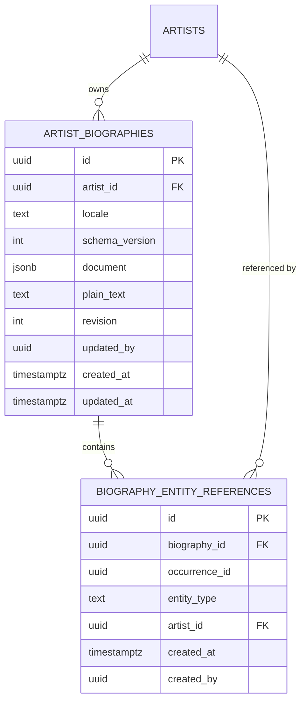

# Mangulina — Artist Citations Inside Biographies

## Architecture investigation

No implementation files, migrations, commits, or remote branches were changed as part of the investigation. This document records the current implementation and the recommended architecture.

## Executive recommendation

Mangulina should treat biography citations as structured editorial content backed by relational references:

- Keep the current `bio_en` and `bio_es` columns intact during migration.
- Introduce one biography document per artist and locale, stored as validated, versioned JSON.
- Represent every citation as an inline document node with an immutable occurrence UUID and localized visible text.
- Store a relational row mapping that occurrence UUID to the referenced artist UUID.
- Resolve all citations in one server-side query and render them through allowlisted React components.
- Never store slugs as citation identity, inject biography HTML, or infer citations by matching names.

The document preserves prose, formatting, wording, and position. The relational row supplies foreign-key integrity, reverse lookup, merge support, validation, and auditability.

## 1. Current biography architecture

### Database storage

The active biography columns are:

- `artists.bio_en text`
- `artists.bio_es text`

They were added by `supabase/migrations/20260626000000_add_artist_multilingual_bios.sql`. That migration copied the legacy `artists.bio` value into `bio_en` when English was empty:

```sql
UPDATE public.artists
SET bio_en = bio
WHERE bio_en IS NULL
  AND bio IS NOT NULL
  AND trim(bio) <> '';
```

English and Spanish therefore use separate nullable text columns. There is no translation table, JSON document, or normalized biography table. The legacy `bio` column remains represented in application types and documentation, but current profile and admin flows use `bio_en` and `bio_es`. No ongoing synchronization with `bio` exists.

The columns are unconstrained `text`. No biography-specific constraint, trigger, view, revision table, or audit table was found.

`supabase/migrations/20260709003000_update_artist_profile_image_fields.sql` defines `get_artist_profile_page(artist_slug text)` and returns `bio_en` and `bio_es` in its JSON response. The function filters the subject artist to `status = 'published'`.

The repository documentation lists `artists.updated_at`, and a maintenance query refers to `trg_artists_updated_at`, but the original trigger definition is not present in the checked-in migration history. A biography save updates the artist row, so a live general-purpose artist timestamp trigger would run; there is no biography-specific timestamp, revision, or editor attribution.

### Current content format

Biographies are a custom Markdown-like text format supporting:

- Blank-line paragraphs
- `## ` headings
- `- ` unordered-list lines
- `> ` blockquote lines
- `**bold**`
- `*italic*`
- `[label](https://url)` external links

This is not full CommonMark and does not use a standard Markdown syntax tree. It is parsed by custom logic in `src/components/molecules/BioText.tsx`.

## 2. Exact files and functions involved

### Database and data access

- `supabase/migrations/20260626000000_add_artist_multilingual_bios.sql`
  - Adds `bio_en` and `bio_es`.
  - Backfills `bio_en` from legacy `bio`.
- `supabase/migrations/20260709003000_update_artist_profile_image_fields.sql`
  - Defines `get_artist_profile_page(artist_slug text)`.
  - Returns both biography strings.
- `src/lib/artistApi.ts`
  - Defines `ArtistProfileData`.
  - `getArtistProfile(slug)` verifies publication, reads the two bio columns, calls `get_artist_profile_page`, and merges the results.
- `src/types/music.ts`
  - Defines a handwritten `Artist` interface containing `bio`, `bio_en`, and `bio_es`.
- `src/lib/supabase.ts`
  - Uses an unparameterized `SupabaseClient`; no generated `Database` TypeScript type was found.

### Public profile

- Route: `src/app/[locale]/artists/[slug]/page.tsx`
- Renderer: `src/components/molecules/BioText.tsx`
- Locale routing: `src/i18n/routing.ts`
- Locale-aware navigation helpers: `src/i18n/navigation.ts`
- Cache invalidation: `src/lib/revalidateArtistProfile.ts`

### Admin editor

- Page and form: `src/app/admin/artists/page.tsx`
- Page authentication: `src/app/admin/artists/layout.tsx`
- Artist write API: `src/app/api/admin/artists/route.ts`
- Role helper: `src/lib/adminApiAuth.ts`
- Search ranking: `src/lib/searchRanking.ts`
- Relationship selector API: `src/app/api/admin/artist-relationships/route.ts`

## 3. Current data flow


### Admin load and editing

The admin page directly queries all artist columns:

```ts
supabase
  .from("artists")
  .select("*")
  .order("name", { ascending: true });
```

Selecting an artist copies `artist.bio_en` and `artist.bio_es` into local `ArtistForm` string state. Each language uses a `<textarea>`. A toolbar inserts textual syntax for headings, lists, quotes, bold, italic, and URL links. `BioText` supplies the live preview.

There is no document-schema validation, reference validation, or malformed-format detection.

### Save

`handleSaveArtist` adds the two nullable strings to the complete artist payload and posts it to `/api/admin/artists`. The route performs one `artists.update(...)` or `artists.insert(...)`, then revalidates old and new slug paths.

There is no biography-specific transaction or audit record.

### Public read and locale selection

The artist route is an async server component. It calls `getArtistProfile(slug)`, then obtains the current locale with `getLocale()`.

- Spanish uses `bio_es`, falling back to `bio_en`.
- English uses `bio_en` only.

The profile receives the full artist record, not just the biography. The selected string is passed to `<BioText bio={localizedBio} />`.

### URL behavior

Current routing uses `localePrefix: "as-needed"` with English as the default locale. Canonical routes are therefore:

- English: `/artists/juan-luis-guerra`
- Spanish: `/es/artists/juan-luis-guerra`

`/en/artists/...` appears in cache-revalidation paths but is not the normal canonical English URL. Citation links should use the `next-intl` navigation `Link` with `/artists/${slug}`, allowing the routing layer to apply the active locale.

## 4. Current rendering and safety

`BioText` renders React nodes and does not use `dangerouslySetInnerHTML`, raw HTML, or an HTML sanitizer. Ordinary content is emitted as React text and escaped by React.

Recognized external links must start with `http://` or `https://` and receive `target="_blank"` plus `rel="noopener noreferrer"`.

The approach is reasonably safe from raw HTML injection, but is not a durable content model:

- Parsing is regex-based.
- Nested or overlapping formatting is unsupported.
- Link parsing is incomplete for complex URLs.
- Malformed markers are not validated.
- There are no typed entity nodes.
- No substring has stable identity.
- A URL-based internal link would be tied to a mutable slug.

## 5. Current admin autocomplete behavior

The main artist picker supports:

- Name, stage name, sort name, slug, province, status, and alias search
- Accent/case normalization through `normalizeSearchText`
- Ranked results through `rankSearchText`
- A 40-result limit
- Arrow Up and Arrow Down navigation
- Enter selection
- Escape dismissal
- Active-option focus management

The relationship picker searches the same already-loaded artists but is simpler. These implementations are embedded in the large admin page instead of a reusable component. Citation work should extract a shared `ArtistCombobox` rather than duplicating them.

Form validation consists primarily of normalization and a general status/error message. There is no per-reference error model or optimistic concurrency.

## 6. Reusable relational conventions

### UUID identity

Mangulina consistently uses `artists.id` UUID foreign keys in `artist_relationships`, `release_artists`, `recording_credits`, `credited_work_credits`, `artist_media`, and legacy release/recording ownership fields.

### Exact visible wording

`release_artists.credited_as` is the closest precedent. It separates canonical `artist_id` identity from the exact historical display wording. Biography citations need the same conceptual separation, with localized wording stored at its inline position in the document.

### Relationship tables

`supabase/migrations/20260704000000_create_release_artists_table.sql` provides the strongest reusable conventions:

- UUID primary key
- Explicit UUID foreign keys
- Forward and reverse indexes
- `created_at` and `updated_at`
- Timestamp trigger
- Published-parent public read policy
- Restricted management policies
- `ON DELETE RESTRICT` for artist targets

`artist_relationships` has source and target indexes and a self-reference check, but uses `ON DELETE CASCADE` and lacks RLS in its checked-in creation migration. The release-credit deletion policy is safer for citations.

### Atomic reassignment

`supabase/migrations/20260710120000_reassign_release_primary_artist.sql` establishes the right merge precedent: coordinated UUID reassignment runs in a locked database transaction/RPC and handles uniqueness conflicts before updating references.

### Additive evolution

Mangulina documents an additive migration approach: add new storage, move consumers, maintain legacy compatibility, and remove old fields only after a stabilization period. Biography migration should follow that pattern.

## 7. Risks in the current format

1. The string cannot distinguish an artist name from ordinary prose.
2. Markdown links store mutable URLs rather than entity identity.
3. Slug changes can break manually entered internal links.
4. Reverse-reference queries require unreliable text searching.
5. Renames, merges, unpublishing, and deletion cannot be handled systematically.
6. Identical occurrences cannot be independently identified.
7. Biography and future relationship changes cannot currently be saved atomically.
8. There is no biography revision history or editor attribution.
9. Handwritten database types can drift from the live schema.
10. The admin loads every artist and every column into the browser.
11. `getArtistProfile` performs an artist query followed by a substantially overlapping profile RPC.
12. Schema documentation is stale around `bio`, `bio_en`, and status values.
13. The custom parser is safe from raw HTML but structurally fragile.
14. `/api/admin/artists` checks `requireAdminApiRole` for `GET`, but its `POST` and `DELETE` handlers do not. Because the server client can use a service-role key, this is a serious existing authorization gap.
15. `/api/admin/artist-relationships` likewise lacks explicit role checks and should not be copied as the citation security pattern.

## 8. Recommended long-term architecture

Use a hybrid document/relational model:



- `artist_biographies.document` is authoritative for ordered content and visible wording.
- `biography_entity_references` is authoritative for the connection between an exact occurrence and an entity UUID.
- The current target slug is fetched at render time.
- `plain_text` is derived transactionally for search, exports, SEO, previews, and verification.
- The relational table supports FK enforcement, reverse queries, integrity reports, merges, and publication decisions.

## 9. Recommended database schema

Conceptually:

```sql
CREATE TABLE public.artist_biographies (
  id uuid PRIMARY KEY DEFAULT gen_random_uuid(),
  artist_id uuid NOT NULL
    REFERENCES public.artists(id) ON DELETE CASCADE,
  locale text NOT NULL CHECK (locale IN ('en', 'es')),
  schema_version integer NOT NULL DEFAULT 1,
  document jsonb NOT NULL,
  plain_text text NOT NULL DEFAULT '',
  revision integer NOT NULL DEFAULT 1 CHECK (revision > 0),
  created_by uuid REFERENCES auth.users(id) ON DELETE SET NULL,
  updated_by uuid REFERENCES auth.users(id) ON DELETE SET NULL,
  created_at timestamptz NOT NULL DEFAULT now(),
  updated_at timestamptz NOT NULL DEFAULT now(),
  UNIQUE (artist_id, locale)
);

CREATE TABLE public.biography_entity_references (
  id uuid PRIMARY KEY DEFAULT gen_random_uuid(),
  biography_id uuid NOT NULL
    REFERENCES public.artist_biographies(id) ON DELETE CASCADE,
  occurrence_id uuid NOT NULL,
  entity_type text NOT NULL CHECK (entity_type IN ('artist')),
  artist_id uuid NOT NULL
    REFERENCES public.artists(id) ON DELETE RESTRICT,
  created_by uuid REFERENCES auth.users(id) ON DELETE SET NULL,
  created_at timestamptz NOT NULL DEFAULT now(),
  UNIQUE (biography_id, occurrence_id)
);
```

### Required indexes

```sql
CREATE UNIQUE INDEX
  ON artist_biographies (artist_id, locale);

CREATE INDEX
  ON biography_entity_references (biography_id);

CREATE UNIQUE INDEX
  ON biography_entity_references (biography_id, occurrence_id);

CREATE INDEX
  ON biography_entity_references (artist_id);

CREATE INDEX
  ON biography_entity_references (artist_id, biography_id);
```

Do not initially add a GIN index to `document`. Entity queries should use the relational table instead of scanning JSON.

### Occurrence identity

Every inserted citation receives a permanent UUID. The same target may therefore appear several times, identical visible strings can be distinguished, and moving a node does not change its identity.

Character offsets should not be primary identity. They become stale after preceding edits and are complicated by Unicode.

### Future entity types

Do not use an unenforced polymorphic `target_id` UUID. When releases or recordings become supported, add typed nullable foreign keys such as `release_id` and `recording_id`, then extend a constraint requiring exactly one target column matching `entity_type`.

The editor and renderer can use a generic entity-reference node and resolver registry while the database retains real FK validation.

## 10. Recommended document format

Use versioned JSON with a small, allowlisted node set:

```json
{
  "version": 1,
  "type": "document",
  "children": [
    {
      "type": "paragraph",
      "children": [
        { "type": "text", "text": "Alex Bueno later worked with " },
        {
          "type": "entityReference",
          "occurrenceId": "e516d63d-0093-45d9-b170-819038953e66",
          "entityType": "artist",
          "text": "Fernando Villalona"
        },
        { "type": "text", "text": " and other prominent artists." }
      ]
    }
  ]
}
```

The related relational row stores the owning biography UUID, occurrence UUID, entity type, and Fernando Villalona's immutable artist UUID.

### Visible wording

Visible wording should be authoritative in each locale-specific document. A canonical artist rename must not silently rewrite prose that may contain a stage name, former name, historical form, or grammatically localized form.

Do not maintain two independently editable copies of visible text in the JSON and relationship table. An optional relational `label_snapshot` may exist for audit/reporting only if it is transactionally derived and explicitly non-authoritative.

### Version 1 nodes

- document
- paragraph
- heading
- bullet list and list item
- blockquote
- text
- bold
- italic
- external link
- entity reference

Raw HTML nodes must be rejected.

## 11. Recommended public rendering flow

1. Fetch the published subject artist by slug.
2. Select its locale biography, applying the current fallback rule.
3. Fetch all relation rows for that biography with their target artist's UUID, current slug, current name, and status.
4. Build a map keyed by occurrence UUID.
5. Validate the JSON document.
6. Render it recursively through an allowlisted React component registry.
7. For an artist reference, find the matching relation and verify its entity type.
8. Render the node's localized visible text.
9. Use a locale-aware `Link` when the target is published.
10. Render safe unlinked text when the target is unavailable or unpublished.

All targets can be retrieved in one joined query:

```ts
.from("biography_entity_references")
.select(`
  occurrence_id,
  entity_type,
  artist:artist_id(id, name, slug, status)
`)
.eq("biography_id", biography.id)
```

There is no need for one query per citation.

Initially, use a dedicated server data-access function such as `getLocalizedArtistBiography(artistId, locale)` returning the document and all resolved references. This is easier to test than expanding the already broad profile RPC. Folding the data into the RPC can remain a measured performance optimization.

## 12. Recommended admin experience

### Insertion

- The editor selects wording or places the caret.
- An Artist Citation button opens a reusable artist combobox.
- Results show name, stage name, disambiguation, status, and optionally a thumbnail.
- Selecting a target creates a reference node with a new occurrence UUID and a pending relationship to the artist UUID.
- Selected text becomes the visible wording; otherwise the canonical name is inserted as a default.

### Display and editing

- Citations appear as styled inline nodes whose target identity is inspectable.
- Editing visible text changes the document but not the target.
- Change Target updates the relational target while preserving the occurrence UUID.
- Remove Citation converts the content to ordinary text and removes the relation.
- Copying a citation generates a new occurrence UUID even when the target is identical.

### Validation

Client and server must validate:

- Supported schema version and nodes
- Unique occurrence UUIDs
- Exactly one relation per reference node
- Exactly one reference node per relation
- Existing target UUIDs
- Matching entity types and typed FKs
- No raw HTML or unknown nodes
- Document size, nesting depth, node count, and citation count limits

The server is authoritative.

### Atomic save

One authenticated endpoint and transaction/RPC should:

1. Compare or lock the current revision.
2. Validate the document.
3. Validate all target UUIDs.
4. Upsert the document.
5. Upsert its current relationship set.
6. Delete removed relationships.
7. Increment the revision.
8. Record `updated_by`.
9. Commit all changes together.

Optimistic concurrency through `revision` prevents silent overwrites between editors.

## 13. Lifecycle behavior

### Slug change

No citation data changes. The renderer resolves the current slug by UUID. Cache invalidation must include biographies referencing that artist.

### Rename

Do not automatically change visible citation wording. Admin reporting may flag wording that differs from the canonical name and offer an explicit update action.

### Unpublished target

Preserve the sentence and visible wording, but render it without a public link. Show the problem in admin preview and integrity reports, not on the public page.

### Archived target

Use an explicit archived/hidden lifecycle. Archived targets normally render as unlinked text unless a canonical replacement exists.

### Duplicate merge

An admin-only transactional merge operation should:

- Move relationship rows from the duplicate UUID to the canonical UUID.
- Preserve occurrence IDs and visible wording.
- Resolve uniqueness collisions.
- Record merge provenance.
- Revalidate biographies found through reverse-reference queries.

An `artist_merge_history` or `artist_redirects` table should record source UUID, canonical UUID, timestamp, editor, and reason.

### Deletion

- Biography ownership may use `ON DELETE CASCADE` because a deleted owner no longer needs its document.
- Referenced artists should use `ON DELETE RESTRICT`.
- Routine removal should archive or hide an artist.
- Duplicates should be merged.
- Hard deletion should be allowed only after dependencies are explicitly reassigned or removed.

The current broad permanent-delete UI should fail safely while citations still reference the artist.

## 14. RLS and authorization

### Public reads

Public biography rows should be readable only when their owning artist is published. Public reference resolution must not expose private metadata about unpublished targets.

### Editorial access

Editors and administrators may read all biography states. Writes should require Mangulina's actual role model rather than merely `auth.role() = 'authenticated'`.

Prefer authenticated Next.js endpoints calling service-role transactional RPCs whose execution is revoked from `PUBLIC`, `anon`, and `authenticated`.

Before citation implementation, mutation authorization must be fixed in:

- `src/app/api/admin/artists/route.ts`
- `src/app/api/admin/artist-relationships/route.ts`

Protecting the admin page is not sufficient protection for direct API calls.

## 15. Security and sanitization

The renderer should:

- Parse validated JSON, never HTML.
- Allow only known node and attribute types.
- Render text as React text children.
- Generate internal URLs from resolved database entities.
- Permit external links only for explicit `http:` and `https:` URLs.
- Apply `noopener noreferrer` to new-window external links.
- Reject `javascript:`, `data:`, event handlers, style attributes, iframes, embeds, and arbitrary nodes.
- Enforce nesting, size, text-length, node-count, and reference-count limits.
- Never trust client-supplied slugs, names, statuses, or target existence.

No HTML sanitizer is required if HTML is never accepted, but runtime document validation remains mandatory.

## 16. Performance

- Resolve all targets in one joined query or RPC; never resolve inside a render loop.
- Cache by biography owner UUID, locale, and referenced artist UUIDs.
- On slug or status changes, use the reverse index to invalidate biographies that mention the changed artist.
- Fetch biography content only for profile/editor contexts rather than attaching it to every artist listing.
- Replace the admin's all-artist `select("*")` autocomplete source with the existing search endpoint or a dedicated debounced, paginated selector endpoint.
- Maintain transactionally derived `plain_text` to avoid repeatedly walking JSON for search, SEO, exports, previews, and verification.

## 17. Migration and compatibility

### Phase 1: additive foundation

- Create biography and reference tables.
- Add validation and a transactional save RPC.
- Leave `bio`, `bio_en`, and `bio_es` untouched.
- Add generated database TypeScript types.

### Phase 2: lossless backfill

For each non-empty locale field:

- Convert the complete string to a version-1 document.
- Preserve every character and paragraph break.
- Convert existing formatting only when unambiguous.
- Preserve ambiguous constructs as ordinary text instead of guessing.
- Create no artist citations automatically.
- Store derived plain text and migration provenance.

### Phase 3: dual-read

Public access should prefer the structured locale document and fall back to the existing text column. Preserve the current Spanish-to-English fallback behavior. Keep `BioText` for legacy records.

### Phase 4: structured writes

Move admin editing to the structured editor and atomic endpoint. During compatibility, optionally derive `bio_en` and `bio_es` from documents for older consumers. Do not allow the structured and legacy editors to independently edit the same locale.

### Phase 5: integrity verification

Report:

- Legacy biography without a document
- Invalid document schema
- Reference node without relation
- Relation without node
- Missing target
- Unpublished target
- Archived or duplicate target
- Mismatched entity type
- Duplicate occurrence UUID
- Legacy and derived-text mismatch

### Phase 6: deprecation

After all consumers use structured biographies, make legacy columns read-only for a defined compatibility period. Remove them only through a separately reviewed future migration.

## 18. Direct answers to the architecture questions

1. **Dedicated relational table?** Yes, for UUID validation, reverse queries, merges, and integrity reporting.
2. **Markers, JSON, or rich-text nodes?** Versioned JSON with editor-generated entity-reference nodes; not textual markers.
3. **Exact localized wording?** Store it in each locale's document node.
4. **Visible text location?** Authoritative in the document only; any relational snapshot must be derived.
5. **Exact position or occurrence?** A permanent occurrence UUID embedded in the node and uniquely mapped relationally.
6. **Unpublished artist?** Render visible text without a public link and report it to administrators.
7. **Slug change?** Resolve the current slug from the UUID; mutate no citation data.
8. **Merge?** Transactionally reassign relationship rows to the canonical UUID while preserving wording and occurrence IDs.
9. **Deletion?** `RESTRICT` citation targets; archive or merge normally.
10. **Plain-text compatibility?** Structured-first dual-read with legacy fallback and lossless backfill.
11. **TypeScript representation?** Versioned discriminated-union nodes, resolved-reference types, runtime schemas, and generated Supabase types.
12. **Safe migration?** Additive tables, deterministic conversion, no name matching, verification, and a long compatibility window.
13. **Indexes?** Owner/locale, biography, unique occurrence, and reverse target-artist indexes.
14. **RLS?** Published-owner public reads and real admin-role-validated writes through guarded APIs/RPCs.
15. **Admin editor?** Inline reference nodes, reusable accessible artist combobox, explicit target controls, preview, and server validation.
16. **Avoid N+1?** Resolve every target for the biography in one joined query or RPC.
17. **One-query retrieval?** Yes, filter references by biography UUID and embed their artist relation.
18. **Resolution layer?** Start with a dedicated server data-access function; merge into the profile RPC only if measurements justify it.
19. **Broken references?** Validate on every save and lifecycle operation, plus provide an admin integrity report.
20. **Future entity types?** Use generic reference nodes and a resolver registry backed by typed nullable foreign keys, not an unenforced polymorphic UUID.

## 19. Phased implementation plan and expected files

### Phase A — schema and types

Create:

- `supabase/migrations/<timestamp>_create_artist_biographies.sql`
- `supabase/migrations/<timestamp>_create_biography_entity_references.sql`
- `supabase/migrations/<timestamp>_create_artist_biography_write_rpc.sql`
- `supabase/migrations/<timestamp>_backfill_artist_biography_documents.sql`
- `src/types/biography.ts`
- `src/types/database.ts` as generated Supabase types

Update:

- `src/lib/supabase.ts`
- `docs/DATABASE_SCHEMA.md`

### Phase B — document model and renderer

Create:

- `src/lib/biography/schema.ts`
- `src/lib/biography/plainText.ts`
- `src/lib/biography/validate.ts`
- `src/lib/biography/data.ts`
- `src/components/biography/BiographyRenderer.tsx`
- `src/components/biography/EntityReference.tsx`
- Unit tests for schema validation, fallback, resolution, and rendering

Update:

- `src/lib/artistApi.ts`
- `src/app/[locale]/artists/[slug]/page.tsx`
- Retain `src/components/molecules/BioText.tsx` as the legacy fallback initially

### Phase C — admin editor

Create:

- `src/components/admin/ArtistCombobox.tsx`
- `src/components/admin/biography/BiographyEditor.tsx`
- `src/components/admin/biography/BiographyToolbar.tsx`
- `src/components/admin/biography/ArtistReferencePopover.tsx`
- `src/app/api/admin/artist-biographies/route.ts`

Update:

- `src/app/admin/artists/page.tsx`
- `src/app/api/admin/artists/route.ts`
- `src/app/api/admin/artist-relationships/route.ts`

### Phase D — lifecycle and integrity

Create:

- Admin broken-reference report and API
- Reverse-reference data-access function
- Artist merge RPC or integration with merge tooling
- Tests for slug changes, renames, unpublishing, archival, merges, and restricted deletion

Update:

- `src/lib/revalidateArtistProfile.ts`
- Artist deletion and merge UI
- Artist status-change flow

### Phase E — deprecation

- Move all consumers to structured biography reads and writes.
- Update documentation and schema types.
- Remove legacy biography columns only in a separately approved migration after the compatibility period.

## Conclusion

The durable boundary is straightforward: the biography document owns human prose, localized wording, formatting, and occurrence placement; the relational table owns immutable entity identity and database integrity. This satisfies stable UUID references, safe locale-aware rendering, reverse queries, mergeability, auditability, and future entity expansion without introducing uncontrolled HTML, slug-bound identity, name matching, or fragile regex-only citations.
